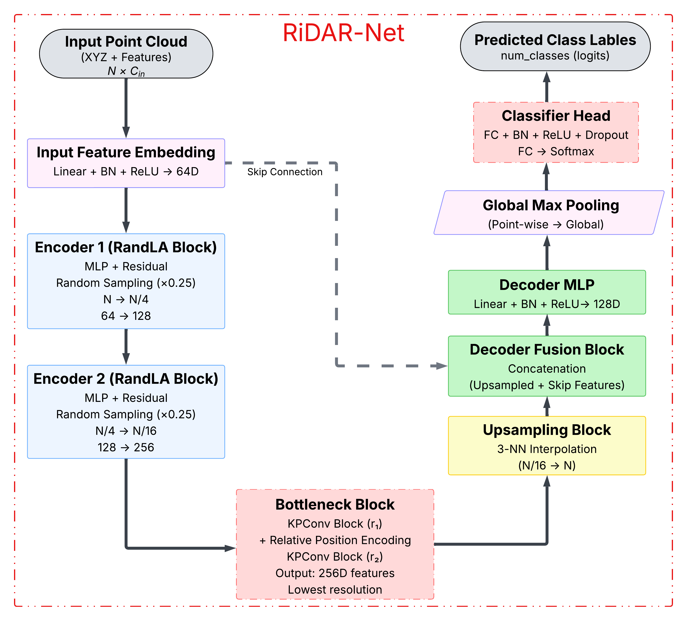
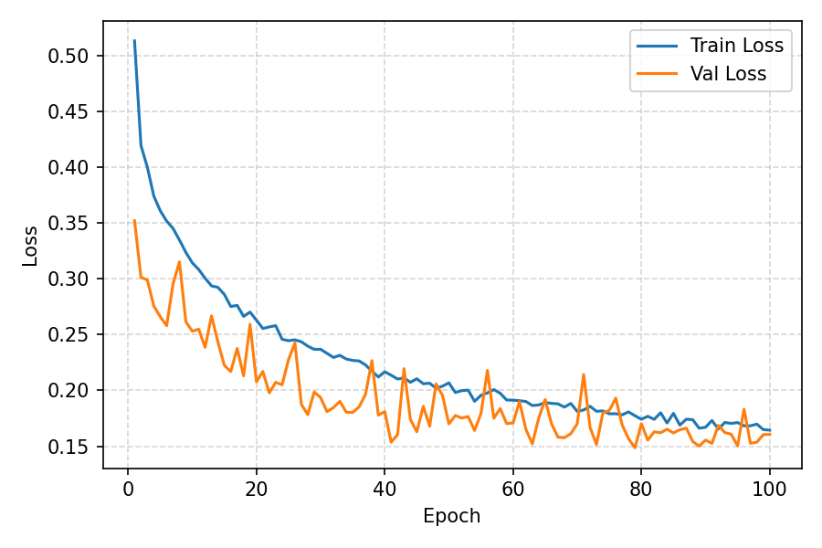
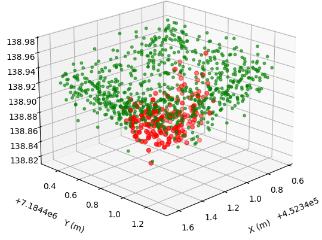

# RiDAR_NET, a LiDAR-only Road Damage Detection model

## Overview

This repository provides a complete pipeline for detecting and visualising road damage (potholes) from LiDAR point cloud data using deep learning.

The project uses a combination of **RandLA-Net** and **KPConv** architectures for patch-based classification and detection.

The repository includes:
- Model building, training, and inference scripts
- Hyperparameter tuning with Grid Search
- Post-processing for per-location voting
- High-resolution visualisation of detected potholes versus ground truth

---

## Folder Structure

```
├── build_model.py        # Model architecture definitions
├── train.py              # Training pipeline
├── inference.py          # Inference & testing
├── post_processing.py    # Per-location voting and aggregation
├── visualization.py      # 2D visualization of results
├── Input Files/          # Preprocessed input datasets (not included)
├── README.md
├── requirements.txt      # Python dependencies
```

---

## Installation

1. Clone the repository:
```bash
git clone https://github.com/YOUR_USERNAME/lidar-road-damage-detection.git
cd lidar-road-damage-detection
```

2. Create a virtual environment (recommended):
```bash
python -m venv venv
source venv/bin/activate  # Linux/Mac
venv\Scripts\activate     # Windows
```

3. Install dependencies:
```bash
pip install -r requirements.txt
```
## Workflow

### 1️⃣ Data Preprocessing
  
*Prepare LiDAR point clouds, extract patches, normalize, and create datasets.*

### 2️⃣ Model Architecture
  
*RandLA-KPConv UNet classifier for multiscale point cloud segmentation.*

### 3️⃣ Loss & Metrics Curves
  
*Training and validation loss, mIoU, and macro F1 curves.*

### 4️⃣ Detection Visualization
  
*Ground-truth vs. detected potholes (red = detected, green = ground truth).*

### Training
```bash
python train.py --data_dir 'Input Files' --train_file 'train4S.pt' --val_file 'val4S.pt' --num_epochs 30
```

### Hyperparameter Tuning
```bash
python train_tune.py
```

### Inference
```bash
python inference.py --model_path 'best_model.pth' --data_dir 'Input Files' --test_file 'test4S.pt'
```

### Post-processing & Visualization
```bash
python post_processing.py
python visualization.py
```

The visualization script generates high-resolution 2D comparison images between detected potholes and ground truth.

### 3️⃣ Loss & Metrics Curves
  
*Training and validation loss, mIoU, and macro F1 curves.*

### 4️⃣ Detection Visualization
  
*Ground-truth vs. detected potholes (red = detected, green = ground truth).*

---

## Dataset

Due to size limitations, the LiDAR dataset is not included. Use your own LiDAR point cloud files in `.las` format and prepare `.pt` datasets as shown in the pipeline.

---

## License

This project is licensed under the MIT License.

---

## Contact

Muhammad Umair - umair.muhammad@und.edu

